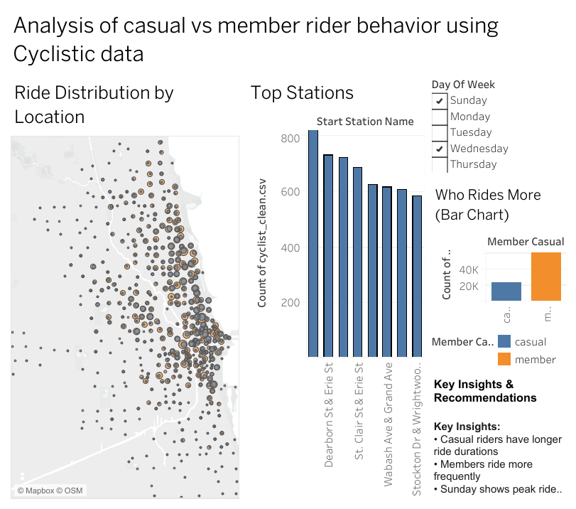

# 🚴 Cyclistic Bike Share Analysis

## 📌 Project Overview
This project analyzes behavioral differences between casual riders and annual members to identify strategies for increasing membership conversion.

---

## 📂 Data Source
- Cyclistic 12-month historical trip data  
- Includes ride duration, stations, timestamps, and user type  

---

## 🧹 Data Cleaning
- Removed null and duplicate records  
- Created derived columns: `ride_length`, `day_of_week`  
- Filtered invalid ride durations  

---

## 🛠️ Tools Used
- SQL (DuckDB)
- Tableau

---

## 📊 Dashboard

🔗 **View Interactive Dashboard:**  
https://public.tableau.com/views/CyclisticBikeShareAnalysisDashboard_17754922286300/Dashboard1

---

## 🔍 Key Insights
- Casual riders have longer ride durations  
- Members ride more frequently  
- Casual riders peak on weekends, members on weekdays  
- Ride density is concentrated in central Chicago  
- High-traffic stations (e.g., Clark St & Elm St) show peak usage  

---

## 💡 Business Recommendations
- Target casual riders with weekend membership campaigns  
- Highlight cost savings for frequent riders  
- Use location-based marketing at high-traffic stations  
- Introduce trial memberships to reduce conversion friction  

---

## 📁 Project Structure

cyclistic-data-analysis/
│
├── data/
├── sql/
│ └── analysis.sql
├── dashboard/
│ ├── dashboard_overview.png
│ ├── user_behavior_chart.png
│ ├── top_stations.png
│
├── README.md

---

## 📈 Conclusion
This analysis highlights key behavioral differences between user types and demonstrates how data-driven strategies can be used to improve customer conversion and business growth.
